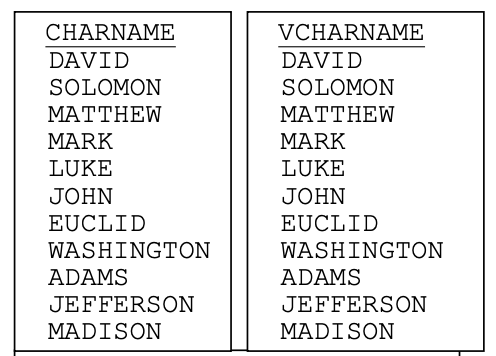
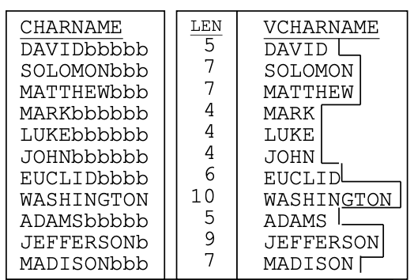

## Intruções

- No arquivo `me315.sqlite` encontram-se as tabelas `PRESERVE` e `EMPLOYEE` criadas na aula anterior.
- Importe o banco de dados no [https://www.sqliteview.com/app](https://www.sqliteview.com/app) ou configure o Rstudio (Posit Cloud) para trabalhar com `SQLIte`

```{r, echo=TRUE, warning=FALSE}
library(DBI)
library(RSQLite)

# Conecta/Cria o arquivo
con <- dbConnect(RSQLite::SQLite(), "datasets/me315.sqlite")
```

# Tabelas

```{sql connection=con, eval=TRUE}
SELECT * FROM PRESERVE
```

```{sql connection=con, eval=TRUE}
SELECT * FROM EMPLOYEE
```


# IN e BETWEEN

1.  Exiba os valores de `PNO`, `PNAME` e `ACRES` de qualquer reserva natural que possua um valor de `ACRES` igual a um dos seguintes valores: \{40, 90, 630, 660\}.

::: {.callout-tip}
# Sintaxe
```{sql connection=con, eval=FALSE}
WHERE nome_da_coluna IN (valor1, valor2, ..., valorN)
```
:::
 
2.  Exiba o `PNO`, `PNAME` e `STATE` de qualquer reserva natural que não esteja localizada no Arizona e não esteja localizada em Montana.
3.  Exiba todas as informações sobre as seguintes reservas naturais: DANCING PRAIRIE, MULESHOE RANCH, MCELWAIN-OLSEN e TATKON.
4.  Exiba o nome e o tamanho de qualquer reserva natural onde seu tamanho esteja entre, ou inclua, 830 e 15.000 acres.


::: {.callout-tip}
# Sintaxe
```{sql connection=con, eval=FALSE}
WHERE nome_da_coluna BETWEEN menor_valor AND maior_valor
```
:::

5.  Exiba o nome e o tamanho de qualquer reserva natural onde seu tamanho não esteja entre 830 e 15.000 acres.


::: {.callout-tip}
# Sintaxe
```{sql connection=con, eval=FALSE}
WHERE nome_da_coluna NOT BETWEEN menor_valor AND maior_valor
```
:::

6.  Exiba o nome de todas as reservas naturais que possuem um nome que, com base em uma sequência alfabética (de ordenação), esteja entre e incluindo as strings 'M' e 'MZZZ'.
7.  Exiba os valores de `PNAME`, `STATE`, `ACRES` e `FEE` de todas as reservas naturais que estejam localizadas em Montana ou no Arizona e tenham um tamanho maior ou igual a 660 acres e menor ou igual a 10.000 acres, ou qualquer outra reserva que possua uma taxa de entrada de $0,00. Ordene o resultado pela coluna `PNAME` em sequência ascendente.


# LIKE


::: {.callout-important}
# CHAR vs VARCHAR


:::


::: {.callout-important}
# CHAR vs VARCHAR

:::


8.  Exiba todos os registros da coluna `CHARNAME` da tabela `DEMO1` que começam com 'MA'.


```{r}
dbListTables(con)
```


```{r}
con_demo <- dbConnect(RSQLite::SQLite(), "demo1.sqlite")
dados_demo <- dbReadTable(con_demo, "DEMO1")
dbWriteTable(con, "DEMO1", dados_demo, overwrite = TRUE)
dbDisconnect(con_demo)
```


```{r}
dbListTables(con)
```

```{sql connection=con}
SELECT * FROM DEMO1
```

9.  Exiba todos os registros da coluna `VCHARNAME` da tabela `DEMO1` que começam com 'MA'.

::: {.callout-tip}
# Sintaxe
```{sql connection=con, eval=FALSE}
WHERE coluna_tipo_texto LIKE 'pattern'
```
:::

10. Exiba todos os registros da coluna `CHARNAME` da tabela `DEMO1` que contenham a letra 'E' em algum lugar do texto'.
11. Exiba todos os registros da coluna `VCHARNAME` da tabela `DEMO1` que contenham a letra 'E' em algum lugar do texto'.
12. Exiba todos os registros da coluna `VCHARNAME` da tabela `DEMO1` que terminem em 'ON'
13. Exiba todos os registros da coluna `CHARNAME` da tabela `DEMO1` que terminem em 'ON'
14. Exiba todos os valores de `CHARNAME` da tabela `DEMO1` que possuem a letra 'S' na quinta posição de string.
15. Repita 14 mas utilizando `CHARNAME`
16. Exiba cada valor de `VCHARNAME` que possua as letras `ON` na sexta e na sétima posição.
17. Exiba qualquer valor de `CHARNAME` que tenha 'ID' na quarta e quinta posições ou que tenha 'ID' na quinta e sexta posições.


# Hands-On

::: {.callout-note}
# Lista 4

1.  Exiba todas as informações de qualquer reserva natural que possua um número de reserva no conjunto \{2, 4, 6, 8, 10\}.
2.  Exiba todas as informações sobre todas as reservas naturais, exceto: DANCING PRAIRIE, MULESHOE RANCH, MCELWAIN-OLSEN e TATKON.
3.  Exiba todas as informações de qualquer reserva natural que possua um valor de `PNO` entre e incluindo 3 e 10.
4.  Exiba todas as informações de qualquer reserva natural que possua um valor de `PNO` menor que 3 ou maior que 10.
5.  Exiba o estado, o número da reserva e o tamanho de qualquer reserva natural que não esteja em Montana e não esteja no Arizona e seja menor que 50 acres ou maior que 800 acres. Ordene o resultado pelo número da reserva em sequência descendente.
6.  Exiba o valor de `PNAME` de todas as reservas naturais com um nome que comece com a letra 'D'.
7.  Exiba o nome de qualquer reserva natural que tenha 'TOWN' em qualquer lugar do seu nome.
8.  Exiba o valor de `PNAME` de todas as reservas naturais com um nome que termine com `PRAIRIE`.
9.  Exiba o nome de qualquer reserva natural que tenha a string 'ING' em qualquer lugar do seu nome.
10. Exiba o nome de qualquer reserva natural cujo nome termine com a letra 'E'.
11. Exiba o nome de qualquer reserva natural que tenha a letra 'E' imediatamente após a letra 'M' em qualquer lugar do seu nome.
12. Exiba o nome de qualquer reserva natural que tenha a letra 'E' em qualquer lugar após a letra 'M' em seu nome.
13. Exiba o nome de qualquer reserva natural que tenha a letra 'A' na segunda posição.
14. Exiba o nome de qualquer reserva natural que tenha um espaço em branco em qualquer lugar do seu nome.
15. Exiba o nome de qualquer reserva natural que tenha 'FARM', 'SWAMP' ou 'PRAIRIE' em qualquer lugar do seu nome.
16. Exiba o nome de qualquer reserva natural com um ponto ou um hífen em qualquer lugar do seu nome.
17. Exiba o nome de qualquer reserva natural que tenha a letra 'R' na quinta posição e termine com 'PRAIRIE'.


Os seguintes exercícios utilizam a tabela `EMPLOYEE`.

18. Exiba todas as informações sobre qualquer funcionário que trabalhe em um departamento com um valor de `DNO` na seguinte lista: \{10, 40\}.
19. Exiba todas as informações sobre qualquer funcionário que trabalhe em um departamento com um valor de `DNO` que não esteja na seguinte lista: \{10, 40\}.
20. Exiba todas as informações sobre qualquer funcionário cujo salário seja maior ou igual a \$500,00 e menor ou igual a \$2.000,00.
21. Exiba todas as informações sobre qualquer funcionário cujo salário seja menor que \$500,00 ou maior que \$2.000,00.
