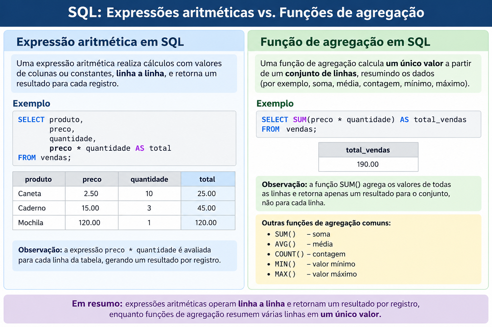

## Intruções

- No arquivo `me315.sqlite` encontram-se as tabelas `PRESERVE` e `EMPLOYEE` criadas na aula anterior.
- Importe o banco de dados no [https://www.sqliteview.com/app](https://www.sqliteview.com/app) ou configure o Rstudio (Posit Cloud) para trabalhar com `SQLIte`

```{r, echo=TRUE, warning=FALSE}
library(DBI)
library(RSQLite)

# Conecta/Cria o arquivo
con <- dbConnect(RSQLite::SQLite(), "datasets/me315.sqlite")
```

# Tabelas

```{sql connection=con, eval=TRUE}
SELECT * FROM PRESERVE
```

```{sql connection=con, eval=TRUE}
SELECT * FROM EMPLOYEE
```


# Introdução


{fig-align="center" width=100%}


# Expressões Aritméticas

1.  Suponha que estejamos interessados em aterar taxas de entrada em reservas naturais localizadas no Arizona. Assim, quatro propostas de alteração foram definidas: 
  a. Aumentar a taxa em US$ 1,50;
  b. Diminuir a taxa em US$ 1,00;
  c. Dobrar a taxa atual;
  d. Reduzir pela metade a taxa atual.
  
Mostre uma tabela com as taxas atuais e as quatro propostas de alteração.

2.  Para cada reserva natural localizada em Montana, apresente os valores de `PNAME` e `ACRES`. Qual é a metade da área de cada reserva? Há alguma diferença entre dividir `ACRES` por 2.0 e por 2?
3.  Apresente os valores de `PNAME` e `FEE` das reservas naturais localizadas no Arizona. Apresente também o resultado de adicionar USD\$ 1,50 a cada valor de `FEE` e o resultado de subtrair USD\$ 1,00 de cada valor de `FEE`. Para cada uma das colunas calculadas, especifique um alias: AUMENTO para a coluna resultante da adição e DIMINUICAO para a coluna resultante da subtração.

::: {.callout-important}
# Atenção

- Os aliases podem ser utilizados na cláusula ORDER BY, mas não na cláusula WHERE. 
- Isso ocorre porque a cláusula WHERE é processada antes da definição dos aliases, enquanto a cláusula ORDER BY é processada depois.
:::


4.  Para cada reserva natural localizada no Arizona, apresente seu nome, seguido pelo resultado da divisão do valor de `ACRES` pelo valor de `FEE`. Exclua as reservas cujo valor de `FEE` seja igual a zero.


::: {.callout-tip}
# Hierarquia SQL

A hierarquia dos operadores aritméticos em SQL é a mesma que você aprendeu no ensino fundamental.

1. As operações de **multiplicação** e **divisão** são avaliadas primeiro, seguindo uma leitura da expressão da esquerda para a direita.
2. Em seguida, as operações de **adição** e **subtração** são avaliadas, também seguindo uma leitura da esquerda para a direita.
3. O uso de **parênteses** pode alterar a ordem de avaliação. As expressões dentro dos parênteses são avaliadas primeiro.
:::

5.  Para cada reserva natural localizada no Arizona, apresente seu nome, seguido pelo resultado de adicionar 1000 ao valor de `ACRES` e, em seguida, dividir o resultado pelo valor de `FEE`. Exclua qualquer registro cujo valor de `FEE` seja igual a zero.
6.  Suponha que a área de cada reserva natural seja triplicada. Apresente o nome e a área de uma reserva se o valor de sua área ajustada exceder 100.000 acres.


# Funções de agregação


Funções de agregação resumem múltiplos valores de uma determinada coluna. Por exemplo, `SUM(ACRES)` retorna a soma dos valores selecionados da coluna `ACRES`, enquanto `AVG(FEE)` retorna a média dos valores selecionados da coluna `FEE`.


Algumas funções de agregação são:


- `SUM()`
- `COUNT()`
- `AVG()`
- `MIN()`
- `MAX()`
- `STDEV()`
- `VARIANCE()`
- Etc.

> Intereresados em mais funções, podem consultar [este site.](https://learn.microsoft.com/pt-br/sql/t-sql/functions/aggregate-functions-transact-sql?view=sql-server-ver17)


7.  Apresente a soma de todos os valores de `ACRES` da tabela `PRESERVE`.
8.  Apresente a área média, em acres, das reservas naturais de Massachusetts.
9.  Apresente a menor e a maior taxa de entrada da tabela `PRESERVE`.
10. O que acontece se aplicarmos `MIN()` e `MAX` em cocunas de texto?. Aplique ambas funções na coluna `PNAME`

> Observação: Não podemos utilizar funções agregadas na clausula WHERE

11. Mostre o número de registros da tabela `PRESERVE`. Utilize `CTPRESERVE` como nome da coluna que apresenta esse resultado.
12. Quantos estados diferentes possuem reservas naturais descritas na tabela `PRESERVE`? Utilize `CTSTATE` como nome da coluna que apresenta esse resultado.
13. Calcule e apresente dois totais resumidos:
  - O primeiro total é a soma de todas as taxas de entrada, considerando que cada taxa tenha sido aumentada em US$ 5,00.
  - O segundo total é o resultado de adicionar US$ 5,00 à soma de todas as taxas de entrada.

# Hands-On

::: {.callout-note}
# Lista 5

1.  Qual seria a nova área (em acres) de cada reserva natural caso sua área atual fosse aumentada em 20\%? Apresente o nome da reserva, a área atual e a nova área após o aumento.
2.  Qual seria a área de cada reserva natural se sua área atual fosse reduzida para um terço do tamanho atual? Apresente o nome da reserva, a área atual em acres e a área ajustada em acres.
3.  Para todas as reservas naturais, apresente o nome da reserva e sua taxa de entrada atual. Apresente também uma taxa ajustada, calculada adicionando US$ 50,00 à taxa atual e, em seguida, dividindo o resultado por 2.
4.  Apresente os valores médio, máximo e mínimo de `ACRES` para todas as reservas naturais localizadas no Arizona.
5.  Apresente o primeiro nome de reserva em ordem alfabética.
6.  Desconsidere as taxas de entrada iguais a zero. Quantas taxas de entrada distintas existem na tabela `PRESERVE`?
7.  Escreva uma instrução `SELECT` que demonstre que `PNAME` não contém atualmente valores duplicados.
8. Suponha que você pretenda estabelecer uma nova política para o cálculo das taxas de entrada. Cada reserva natural cobrará uma taxa de US$ 0,02 por acre. Qual será a taxa média de entrada das reservas naturais localizadas no Arizona?


As seguintes questões utilizam a tabela `EMPLOYEE`

9.  Suponha que o salário de cada funcionário seja aumentado em 10%. Apresente o número do funcionário, seu nome, salário antigo e novo salário. A tabela resultante deve ter quatro colunas denominadas ENO, ENAME, OLDSALARY e NEWSALARY. Ordene o resultado pelo novo salário.
10. Modifique o exercício anterior. Apresente apenas os registros dos funcionários cujo novo salário seja superior a US$ 2.000,00.
11. Apresente a soma, a média, o valor máximo e o valor mínimo de todos os valores de SALARY.
12. Quantos funcionários trabalham no Departamento 20?
13. Quantos departamentos possuem funcionários?

:::

